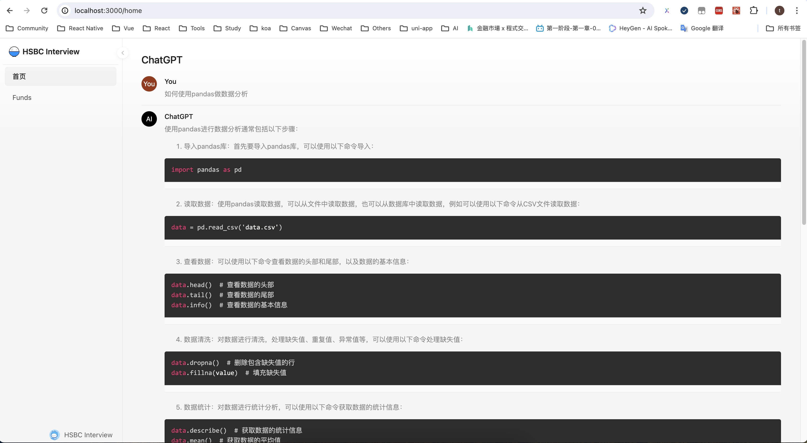
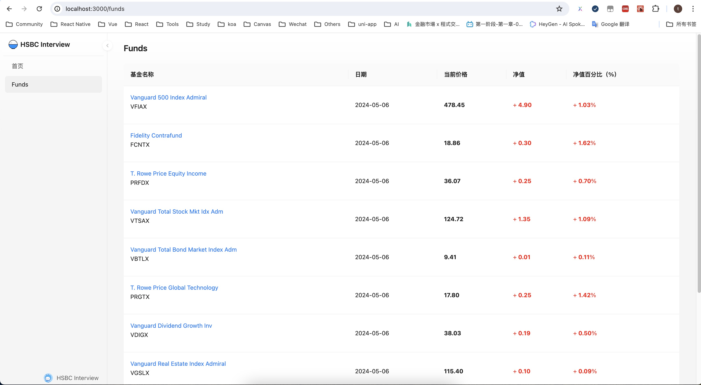
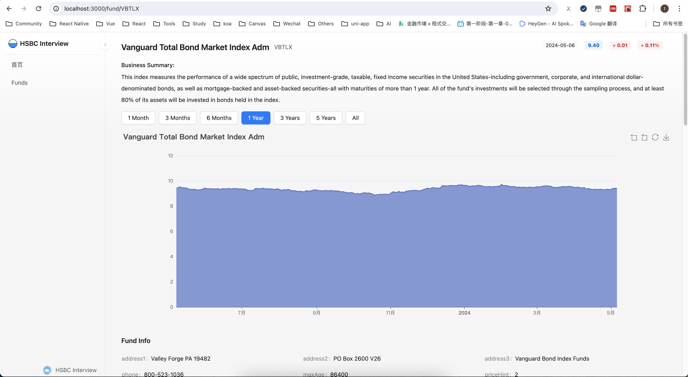
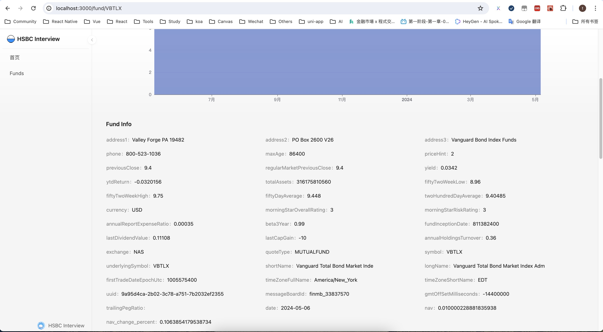
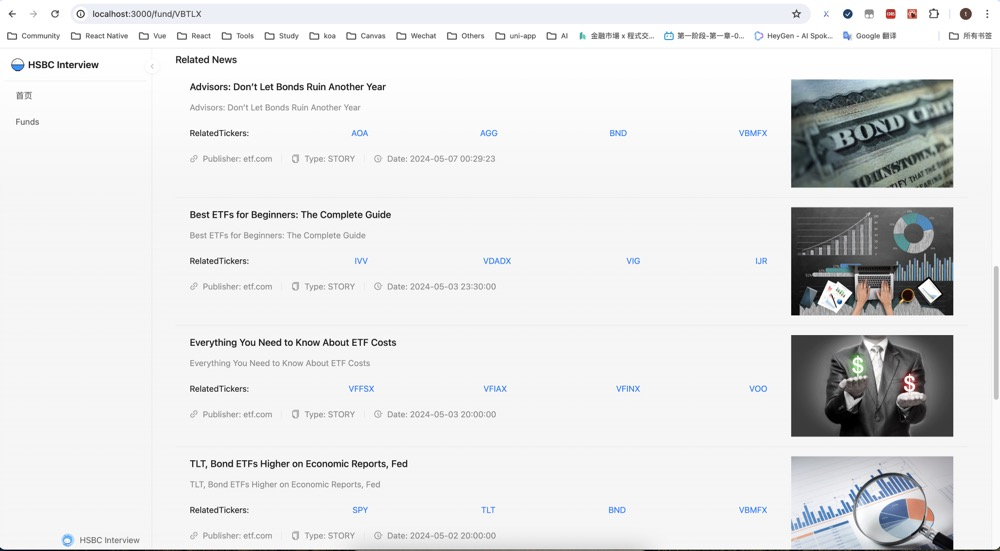

# README

## Basic Summary

This is a simple project prepared for the HSBC interview test. It adopts the form of front-end and back-end separation. The front-end uses the React framework and is built based on UmiJS. The back-end service is implemented in Python.


## Install Python
To run this project, you will need to ensure you have Python installed. 
To download Python, head to the [official Python website](https://www.python.org/downloads/) and download the latest version. 

## Usage

1. Clone project code.

```bash
git clone https://github.com/TheSixer/interview-pro.git

cd interview-pro
```

2. Installation dependence.

```bash
pnpm install
```

3. Installation back-end dependence.
   The directory for the backend service is `server/hsbcInterview`, Set up a virtual environment (optional)

```bash
cd server/hsbcInterview
python -m venv .venv

# windows
.venv\Scripts\activate

# Linux/MacOS
source .venv/bin/activate
```
4. With the virtual environment activated, use ` pip ` to install all dependencies listed in ` requirements.txt `:

```bash
pip install -r requirements.txt
```

5. Start local server.
```bash
npm run start
```

6. After the startup is complete, open a browser and visit [http://localhost:3000](http://localhost:3000), If you need to change the startup port, you can configure it in the `.env` file.

## OPENAI_API_KEY

` OPENAI_API_KEY ` is required to use the ChatGPT conversation function. Unfortunately, I cannot provide the real key. If you want to test the conversation function, you can add `OPENAI_API_KEY` to ` server/hsbcInterview/.env `.

```py server/.env
# .env

OPENAI_API_KEY=test_key
```

## ScreenShots










